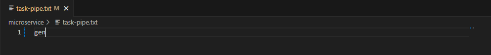
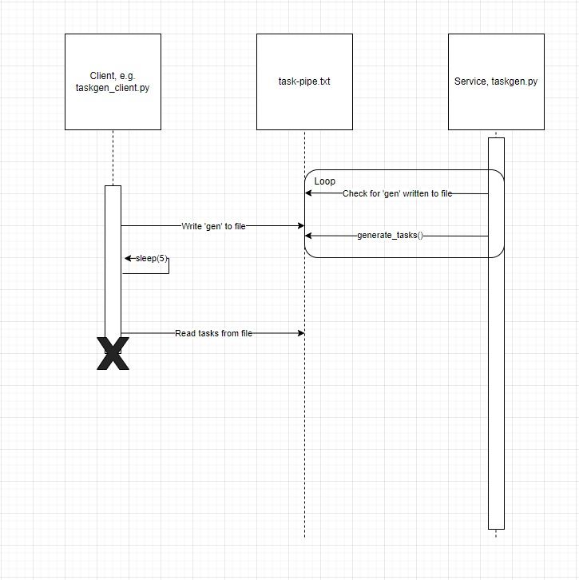

### About
This repository contains a microservice called taskgen, and a test application called taskgen_client. 

### How can I call this service?
To make a request to this service, simply clear out the file called task-pipe.txt and write the word "gen" to it. The microservice will be checking this file every 2 seconds to see if a request has been made. An example call to this microservice looks like this: 

### How will I receive a response from this service?
Once a request has been made to the service, within the next 5 seconds, the service will write a response containing 5 example tasks to the file task-pipe.txt. This clears the "gen" call so that the service will only respond when asked. You can then read the data from this file and use it as needed.

### UML sequence diagram

